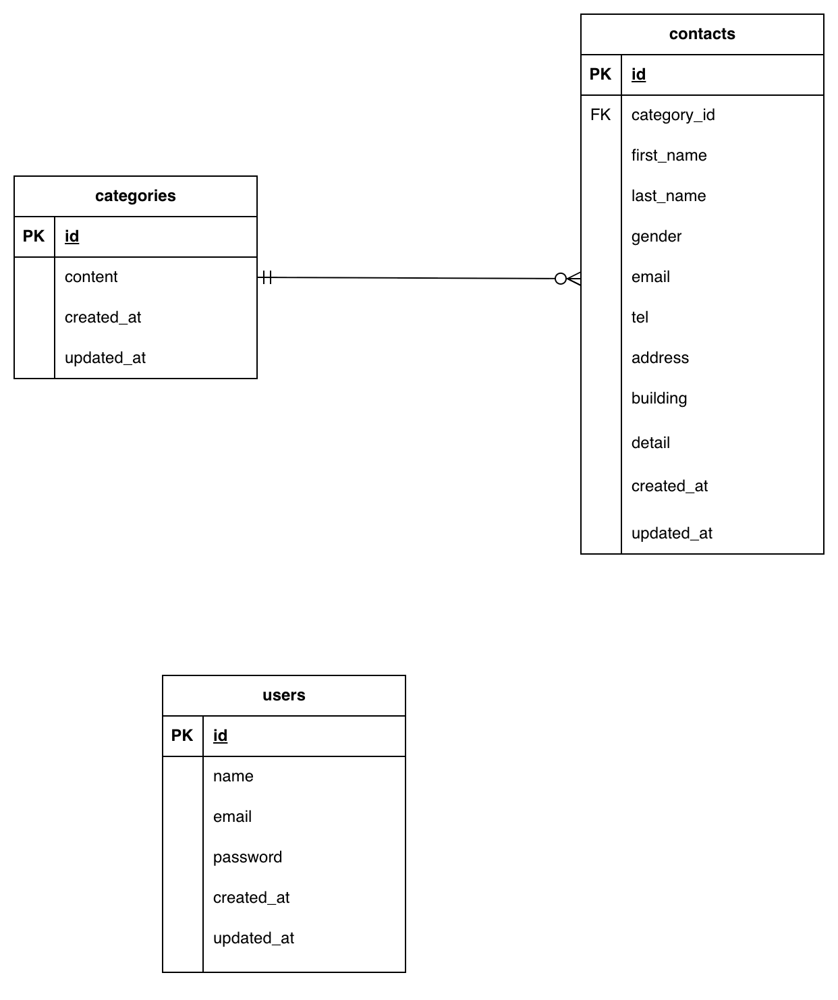

# お問い合わせフォームアプリ

## アプリケーション名

お問い合わせフォーム

## 環境構築

### Dockerビルド

1. リポジトリをクローン
git clone https://github.com/sakisugi29/contact.git

2. ディレクトリに移動
cd contact

3. Dockerコンテナを作成
docker compose up -d --build
---

### Laravel環境構築

1. PHPコンテナに入る
docker compose exec php bash

2. Composerインストール
composer install

3. .envファイル作成
cp .env.example .env

4. アプリケーションキー作成
php artisan key:generate

5. マイグレーション実行
php artisan migrate
---

## 使用技術(実行環境)

* PHP 8.x
* Laravel 8.x
* MySQL 8.x
* Nginx
* Docker

---

## ER図

---

## URL

* 開発環境: http://localhost/
* phpMyAdmin: http://localhost:8080/
